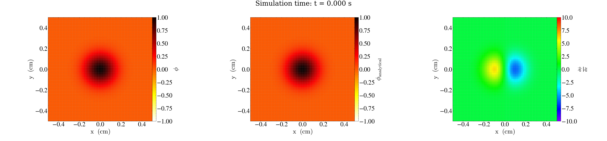
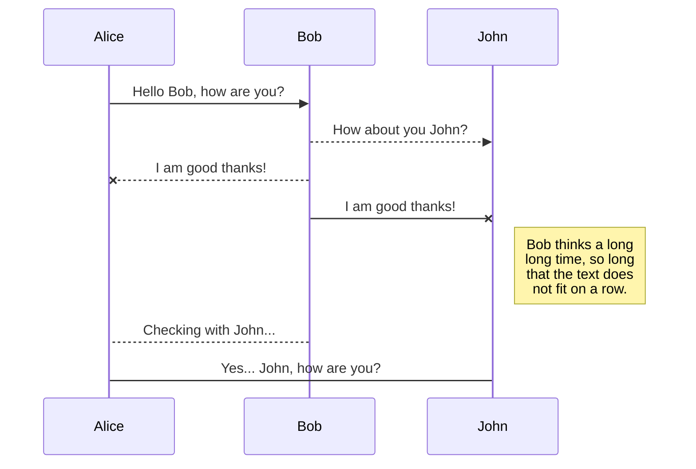
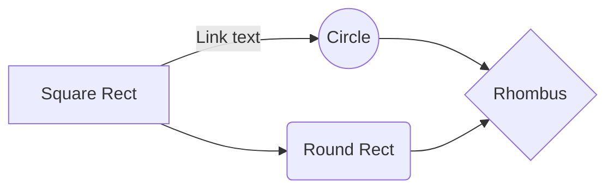

# AMR Postprocessing

This is a template for README.md

## 1. Figure



## 2. How to input a emoji

### 2.1 文档标题/分类常用 Emoji
| 表情 | 含义      | Markdown写法 | `:emoji_name:`     |
| -- | ------- | ---------- | ------------------ |
| 📖 | 文档、说明   | `📖`       | `:book:`           |
| 📚 | 参考资料、文献 | `📚`       | `:books:`          |
| 📝 | 笔记、记录   | `📝`       | `:memo:`           |
| 📦 | 打包、依赖   | `📦`       | `:package:`        |
| 📄 | 文件      | `📄`       | `:page_facing_up:` |
| 📌 | 重点      | `📌`       | `:pushpin:`        |
| 🔗 | 链接      | `🔗`       | `:link:`           |

### 2.1 项目/功能状态
| 表情  | 含义     | Markdown写法 | `:emoji_name:`        |
| --- | ------ | ---------- | --------------------- |
| 🚀  | 启动、发布  | `🚀`       | `:rocket:`            |
| ✅   | 已完成、支持 | `✅`        | `:white_check_mark:`  |
| ❌   | 不支持、失败 | `❌`        | `:x:`                 |
| ⚠️  | 警告、注意  | `⚠️`       | `:warning:`           |
| 🔧  | 工具、配置  | `🔧`       | `:wrench:`            |
| 🔍  | 搜索、分析  | `🔍`       | `:mag:`               |
| 🛠️ | 开发、维护  | `🛠️`      | `:hammer_and_wrench:` |

### 2.2 科研/测试/计算类
| 表情 | 含义    | Markdown写法 | `:emoji_name:`               |
| -- | ----- | ---------- | ---------------------------- |
| 🧪 | 实验、测试 | `🧪`       | `:test_tube:`                |
| 🧠 | 算法、智能 | `🧠`       | `:brain:`                    |
| 💻 | 代码    | `💻`       | `:computer:`                 |
| 🧮 | 计算    | `🧮`       | `:abacus:`                   |
| 📊 | 图表    | `📊`       | `:bar_chart:`                |
| 📈 | 上升趋势  | `📈`       | `:chart_with_upwards_trend:` |

### 2.3 教程/说明/帮助类
| 表情 | 含义    | Markdown写法 | `:emoji_name:`     |
| -- | ----- | ---------- | ------------------ |
| 💡 | 提示    | `💡`       | `:bulb:`           |
| ❓  | 问题    | `❓`        | `:question:`       |
| 💬 | 说明、对话 | `💬`       | `:speech_balloon:` |
| 📫 | 联系方式  | `📫`       | `:mailbox:`        |
| 🆘 | 求助    | `🆘`       | `:sos:`            |


## 3. Sript
```javescript
const name = 1
```


## 4. SmartyPants

SmartyPants converts ASCII punctuation characters into "smart" typographic punctuation HTML entities. For example:

|                |ASCII                          |HTML                         |
|----------------|-------------------------------|-----------------------------|
|Single backticks|`'Isn't this fun?'`            |'Isn't this fun?'            |
|Quotes          |`"Isn't this fun?"`            |"Isn't this fun?"            |
|Dashes          |`-- is en-dash, --- is em-dash`|-- is en-dash, --- is em-dash|


## 5. KaTeX

You can render LaTeX mathematical expressions using [KaTeX](https://khan.github.io/KaTeX/):

The *Gamma function* satisfying $\Gamma(n) = (n-1)!\quad\forall n\in\mathbb N$ is via the Euler integral

$$
\Gamma(z) = \int_0^\infty t^{z-1}e^{-t}dt\,.
$$

> You can find more information about **LaTeX** mathematical expressions [here](http://meta.math.stackexchange.com/questions/5020/mathjax-basic-tutorial-and-quick-reference).


## 6. UML diagrams

You can render UML diagrams using [Mermaid](https://mermaidjs.github.io/). For example, this will produce a sequence diagram:



And this will produce a flow chart:




## 7. Publication and Citation


## 📄 7.1 Publication

- **Jin, S.**, & Smith, J. (2024). *A CIP-Based Adaptive Scheme for Compressible Flows*. **Journal of Computational Physics**. [[Link](https://doi.org/10.1016/j.jcp.2024.111234)]
- **Jin, S.**, (2023). *High-Resolution SPH Simulation for Ocean Engineering*. **Ocean Modelling**. [[PDF](./papers/SPH2023.pdf)]


Publishing in StackEdit makes it simple for you to publish online your files. Once you're happy with a file, you can publish it to different hosting platforms like **Blogger**, **Dropbox**, **Gist**, **GitHub**, **Google Drive**, **WordPress** and **Zendesk**. With [Handlebars templates](http://handlebarsjs.com/), you have full control over what you export.

> Before starting to publish, you must link an account in the **Publish** sub-menu.


### 📚 7.2 Citation (BibTeX)

```bibtex
@article{jin2024cip,
  title={A CIP-Based Adaptive Scheme for Compressible Flows},
  author={Jin, Shanqin and Smith, John},
  journal={Journal of Computational Physics},
  year={2024},
  volume={123},
  pages={1--20},
  doi={10.1016/j.jcp.2024.111234}
}
